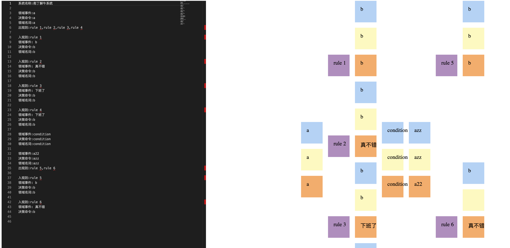

# Pao

> A Online DSL DDD design tool with Monaco & Antlr.

example DSL:

```
系统名称:庖丁解牛系统

领域事件:a
决策命令:a
领域名词:a
出规则:rule 1,rule 2,rule 3,rule 4

入规则:rule 1
领域事件: b
决策命令:b
领域名词:b
````



License
---

[](http://ideas.phodal.com/)

@ 2020 A [Phodal Huang](https://www.phodal.com)'s [Idea](http://github.com/phodal/ideas).  This code is distributed under the MPL license. See `LICENSE` in this directory.
